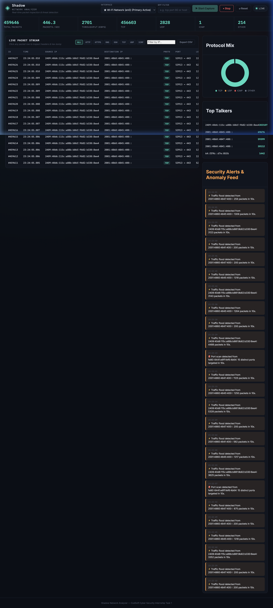
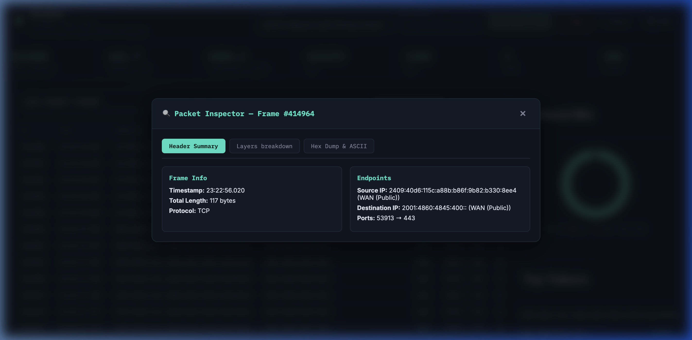

# 🕶️ Shadow Network Analyzer

> **Real-Time Network Packet Inspection, Threat Detection & Security Dashboard**  
> Built for the **CodSoft Cyber Security Internship — Task 1 (Network Packet Analyzer)**.

---

## 📸 Screenshots Showcase

### 📊 Real-Time Security Dashboard & Threat Feed


### 🔍 Deep Packet Inspector (Layer Breakdown & Hex Dump)


---

## ✨ Features

### ⚡ Core Features (Task Requirements)
- **Live Packet Capture**: Captures real-time network traffic via raw sockets using **Scapy**.
- **Multi-Protocol Support**: Decodes IPv4, IPv6, TCP, UDP, ICMP, ICMPv6, and ARP packets.
- **Deep Metadata Parsing**: Extracts Source IP, Destination IP, Protocol, Source/Destination Ports, Payload length, and Time To Live (TTL).

### 🛡️ Advanced Security & Monitoring Additions
- 🖥️ **Live Web Dashboard (Flask)**: Modern cyber-themed UI; no need to read raw terminal output.
- 🚨 **Automated Anomaly Heuristics**:
  - **Port Scan Detection**: Flags source IPs targeting over 15 unique destination ports within a sliding window.
  - **Traffic Flood Detection**: Flags source IPs exceeding 200 packets per 10-second window.
- 📊 **Protocol Distribution Chart**: Real-time donut chart visualizing TCP, UDP, ICMP, and Other protocol ratios.
- 🏆 **Top Talkers Panel**: Ranked list of the most active IP endpoints in the current session.
- 🔍 **Packet Inspector Modal**: Click any packet row to inspect:
  - **Frame Summary**: Timestamp, packet size, and endpoints.
  - **Layer Breakdown**: Ethernet (L2), IP (L3), Transport (L4) header flag values.
  - **Hex Dump & ASCII View**: Inspection of raw frame bytes.
- ⚙️ **BPF Expression Filter**: Supports custom Berkeley Packet Filters (e.g. `tcp port 80`, `host 1.1.1.1`).
- 📤 **CSV Session Export**: Download captured traffic for offline forensics or internship reports.
- ⚡ **Simulated Traffic Demo Mode**: Allows instant testing without root/admin permissions.

---

## 🗂️ Project Structure

```text
shadow_network_analyzer/
├── start.bat               # One-click startup batch script for Windows
├── start.sh                # Executable startup shell script for macOS & Linux
├── app.py                  # Flask web server & REST API endpoints
├── capture_engine.py       # Scapy packet capture, parsing engine & security heuristics
├── requirements.txt        # Python dependency manifest
├── fix_mac_permissions.sh  # macOS /dev/bpf permission configuration helper
├── .gitignore              # Git ignore configuration
├── screenshots/
│   ├── dashboard.png       # Live monitoring dashboard preview screenshot
│   └── packet_inspector.png# Packet detail modal preview screenshot
├── templates/
│   └── index.html          # Web dashboard layout template
└── static/
    ├── style.css           # Dark cyber-themed styling system
    └── script.js           # Live polling, Chart.js integration, and UI event handling
```

---

## 🚀 Quick Start & Installation

### Option 1: Automated Launcher (Recommended)

#### 🪟 Windows Users:
Simply double-click `start.bat` or run in Command Prompt:
```cmd
start.bat
```
*(Note: Windows requires **[Npcap](https://npcap.com/#download)** installed in "WinPcap API-compatible Mode" for live raw packet sniffing).*

#### 🍎 macOS & 🐧 Linux Users:
Run the interactive startup script in your terminal:
```bash
./start.sh
```

---

### Option 2: Manual Setup

1. **Clone the repository**:
   ```bash
   git clone https://github.com/your-username/CODSOFT_TASK1.git
   cd CODSOFT_TASK1
   ```

2. **Create & activate a virtual environment**:
   ```bash
   python3 -m venv venv
   source venv/bin/activate        # On macOS/Linux
   # or
   venv\Scripts\activate.bat       # On Windows
   ```

3. **Install dependencies**:
   ```bash
   pip install -r requirements.txt
   ```

4. **Launch the Analyzer with Administrator/Root Privileges**:
   - **macOS / Linux**:
     ```bash
     sudo ./venv/bin/python app.py
     ```
     *(Or run once: `sudo ./fix_mac_permissions.sh` to allow non-root capture on macOS)*.
   - **Windows** (Open Command Prompt as Administrator):
     ```cmd
     python app.py
     ```

5. **Open Dashboard**:
   Navigate to `http://127.0.0.1:5000` in your web browser.

---

## 🧪 Demonstration Guide (For CodSoft Video Submission)

1. **Launch App**: Start `start.bat` (Windows) or `./start.sh` (macOS/Linux) and open `http://127.0.0.1:5000`.
2. **Start Traffic Stream**: Select your network interface (or `⚡ [DEMO] Simulated Traffic`) and click **▶ Start Capture**.
3. **Show Protocol Mix & Top Talkers**: Point out live packet count updates, bandwidth throughput, and the dynamic chart.
4. **Inspect Packets**: Click any packet row in the Live Stream table to display the **Packet Inspector Modal** showing header breakdown and Hex dump.
5. **Demonstrate Threat Detection**: Observe automatic alerts triggering in the **Security Alerts & Anomaly Feed** when scan/flood traffic is detected.
6. **Export Data**: Click **Export CSV** to download captured packet logs for your submission report.

---

## 🛡️ License & Disclaimer

This project is created strictly for **educational and research purposes** as part of the **CodSoft Cyber Security Internship**. Only capture network traffic on systems you own or have explicit permission to audit.

---

## 📌 Submission Checklist

- [x] Create clean `start.bat` and `start.sh` launchers
- [x] Maintain accurate `requirements.txt`
- [x] Embed high-resolution dashboard screenshots in `README.md`
- [x] Commit and push changes to GitHub repository
